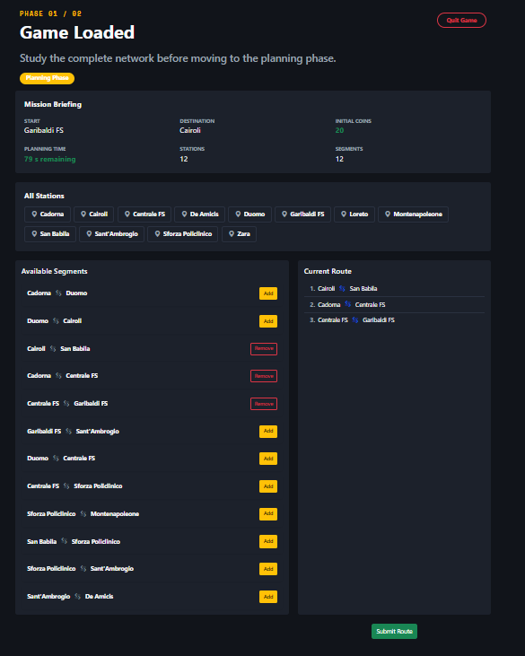
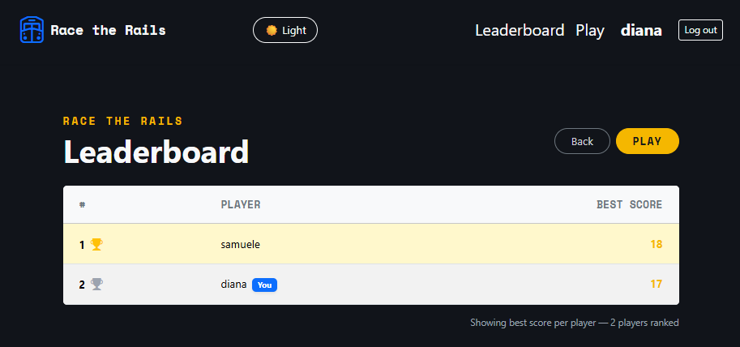

# Exam 1: "Last Race"
## Student: s349506 CARUSO SAMUELE 

## React Client Application Routes

- Route `/`: **Landing Page**. The presentation page accessible to all users before authentication.

- Route `/login`: **Login Page**. Allows users to authenticate to access game functionalities.

- Route `/home`: **Home Page (Dashboard)**. The control center for the authenticated user, where they can start a new game or consult the leaderboard. This route is protected and accessible only to authenticated users.

- Route `/play`: **Game Page**. The main route of the game, where the setup, planning, and execution phases take place. This route is protected and accessible only to authenticated users.

- Route `/leaderboard`: **Leaderboard Page**. Displays the ranking of the best players based on scores obtained in completed games. This route is protected and accessible only to authenticated users.

- \* : **Not Found Page**. An error handling page for undefined routes.

## API Server

- POST `/api/sessions`
  - **Description**: Authenticates a user using their credentials and establishes a new session.
  - **Request parameters** : None 
  - **Request body content** : 
      ```json
        {
          "username": "samu",
          "password": "noneOfYourBusiness"
        }
      ```
  - **Response body content** : 
    - *(HTTP 200)* Returns an object containing the authenticated user's information.

      ```json
        {
          "id" : 1,
          "username": "samu",
          "name": "samuele"
        }
      ```
    -  *(HTTP 401)* Returns an error message indicating invalid credentials.
          
          ```json
            {
              "error": "Incorrect username or password."
            }
          ```

    -  *(HTTP 400)* Returns an error if the request body is missing required fields.
         
          ```json
            {
              "error": "Missing username or password."
            }
          ```
  
- GET `/api/sessions/current`
  - **Description** : Returns the data of the currently logged-in user.
  - **Request parameters** : None
  - **Request body content** : None
  - **Response body content** : 
    - *(HTTP 200)* User object.
      ```json
        {
          "id": 1,
          "username": "samuele",
          "name": "Samuele"
        }
      ```
    - *(HTTP 401)* If the user is not authenticated.
      ```json
        {
          "error": "Not authenticated"
        }
      ```

- DELETE `/api/sessions/current`
  - **Description** : Logs out the current user and clears the session.
  - **Request parameters** : None
  - **Request body content** : None
  - **Response body content** : 
    - *(HTTP 200)* Confirmation message.
      ```json
        {
          "message": "Logged out"
        }
      ```

- GET `/api/network/map`
  - **Description** : Retrieves the complete network map, including stations, available lines, station-line mappings, and segments.
  - **Request parameters** : None
  - **Request body content** : None
  - **Response body content** : 
    - *(HTTP 200)* Returns the network configuration object.
      ```json
          {
            "stations": [{"id": 1, "name": "Cadorna"}, ...],
            "lines": [{"id": 1, "name": "M1", "color": "#d62828"}, ...],
            "lineStations": [...],
            "segments": [...]
          }
        ```
    - *(HTTP 500)* Returns an error message if the map fails to load.
      ```json
          {
            "error": "Failed to load network map"
          }
        ```

- POST `/api/games`
  - **Description** : Initiates a new game session.
  - **Request parameters** : None
  - **Request body content** : None
  - **Response body content** : 
    - *(HTTP 201)* Returns the new game details.
      ```json
          {
            "gameId": 12,
            "startStation": {"id": 1, "name": "Cadorna"},
            "destinationStation": {"id": 2, "name": "Duomo"},
            "initialCoins": 20,
            "status": "planning"
          }
        ```
    - *(HTTP 500)* Returns an error message if the game creation fails.
      ```json
          {
            "error": "Failed to create game"
          }
        ```

- GET `/api/games/:id/planning-data`
  - **Description** : Retrieves the data required for the planning phase of a specific game.
  - **Request parameters** : `id`. The unique ID of the game.
  - **Request body content** : None
  - **Response body content** :
    - *(HTTP 200)* Returns the planning data
      ```json
            {
              "gameId": 12,
              "startStation": {"id": 1, "name": "Cadorna"},
              "destinationStation": {"id": 2, "name": "Duomo"},
              "stations": [...],
              "segments": [...],
              "timeLimitSeconds": 90
            }
          ```
    - *(HTTP 404)* If the game is not found or does not belong to the user.
      ```json
            {
              "error": "Game not found"
            }
          ```

- POST `/api/games/:id/submit-route`
  - **Description** : Submits the chosen route for validation and execution.
  - **Request parameters** : `id`. The unique ID of the game.
  - **Request body content** : `routeStationIds` (array). List of station IDs representing the planned route.
    ```json
      "routeStationIds": [1, 5, 2]
    ```
  - **Response body content** : 
    - *(HTTP 2002)* Returns the validation result and execution steps.
      ```json
        "valid": true,
        "steps": [{"stepIndex": 1, "fromStationId": 1, "toStationId": 5, "event": {...}, "coinsAfterStep": 18}],
        "finalScore": 18,
        "isNewBestScore": false
      ```

- POST `/api/games/:id/quit`
  - **Description** : Marks a game as abandoned (quitted) so it doesn't count towards the leaderboard.
  - **Request parameters** : `id`. The unique ID of the game.
  - **Request body content** : None
  - **Response body content** : 
    - *(HTTP 200)* Success message.
      ```json
        {
          "message": "Game quitted successfully"
        }
      ```

- GET `/api/ranking`
  - **Description** : Retrieves the global leaderboard ranking of the best players.
  - **Request parameters** : None
  - **Request body content** : None
  - **Response body content** : 
    - *(HTTP 200)* Returns an array of players sorted by their best score.
      ```json
        [
          {"username": "samu", "name": "Samuele", "best_score": 18},
          {"username": "diana", "name": "Diana", "best_score": 15}
        ]
      ```


## Database Tables

- Table `users` - contains the user `id` (primary key), `username` (unique identifier), `name` (name), `hash` (password hash), and `salt` (cryptographic salt).

- Table `stations` - contains the station `id` (primary key) and the `name` of the station.

- Table `lines` - contains the line `id` (primary key), `name` (e.g., "M1"), and `color` (hexadecimal color code).

- Table `line_stations` - contains the association between lines and stations, including `line_id`, `station_id`, and the `position` of the station along that line.

- Table `events` - contains the event `id` (primary key), `description` of the event, and the `effect` (an integer modifier for coins, ranging from -4 to 4).

- Table `games` - contains the game `id` (primary key), `user_id` (foreign key to users), `start_station_id`, `destination_station_id`, `initial_coins`, `final_score`, game `status` (e.g., "planning", "completed", "quitted"), and `created_at` timestamp.

- Table `game_steps` - contains the step `id` (primary key), `game_id` (foreign key), `step_index`, `from_station_id`, `to_station_id`, `event_id` (foreign key to events), and the `coins_after_step`.

## Main React Components

- `AppLayout` (in `App.jsx` and `AppLayout.jsx`): The main layout component that defines the persistent structure of the application. It includes the `NavigationBar` and a main Container (acting as a shell) where nested pages are rendered via the Outlet component.

- `ExecutionPage` (in `ExecutionPage.jsx`): Manages the final stage of the game. It displays the validation results of the planned route, executes the journey step-by-step (showing random events and coin balance updates), and handles the end-of-game state (success or failure). It provides actions for replaying, creating a new game, viewing the leaderboard, or returning home.

- `HomePage` (in `HomePage.jsx`): The dashboard for authenticated users. It greets the user by name (or username) and provides primary call-to-action buttons to start a new game (`/play`) or view the global rankings (`/leaderboard`).

- `LandingPage` (in `LandingPage.jsx`): The public welcome page. It introduces the application ("Race the Rails"), outlines the four gameplay phases (Setup, Plan, Execute, Result) using a card-based instruction layout, and prompts unauthenticated users to log in.

- `LeaderboardPage` (in `LeaderboardPage.jsx`): Fetches global ranking data using `gameAPI.getRanking()` and renders it in a responsive table. It highlights the current user's row, uses specific styling/icons for top-three players, and displays the personal best score.

- `LoginPage` (in `LoginPage.jsx`): Handles the user authentication form. It manages username and password state, displays loading spinners during authentication, and shows error alerts for invalid credentials. Upon successful login, it redirects the user to the dashboard.

- `NavigationBar` (in `NavigationBar.jsx`): A dynamic navigation bar that adjusts its content based on the user's authentication state. It features a theme toggle (Dark/Light mode), links to the leaderboard and play pages, and user identification. It is configured to hide itself when the user is on the `/play` route.

- `NotFoundPage` (in `NotFoundPage.jsx`): A fallback component displayed for undefined routes. It provides a 404 error message and a navigation button to return the user to the landing page.

- `PlayPage` (in `PlayPage.jsx`): The core component managing the game's lifecycle. It orchestrates data loading (network map, game state, planning data), handles the route planning logic (segment selection and removal), manages the planning timer, and performs the final route submission to the server.

- `ProtectedRoute` (in `ProtectedRoute.jsx`): A wrapper component used for route security. It checks the `isLoggedIn` status from `AuthContext` before rendering children. If the user is unauthenticated, it redirects them to the `/login` page; otherwise, it displays a loading spinner until the authentication state is ready.

## Screenshot




## Users Credentials

- `username`: samuele, `password`: SamuCar02

- `username`: diana, `password`: didi03

- `username`: franco, `password`: FrancoCar04

## Use of AI Tools
During the development of this project, I utilized AI tools (specifically **Gemini**) to assist with several technical and design tasks. My workflow involved using AI as a supportive pair-programmer.

- **Styling and UI/UX**: I used AI to generate and refine the styling of the application. This helped in achieving a more polished and professional interface.

- **Database Schema & SQL**: I leveraged AI to structure and initialize the SQL database schemas and the initial data population script (`initDB.js`), ensuring that the tables were correctly normalized and indexed.

- **Graph & BFS**: I consulted AI to implement the graph construction and the Breadth-First Search (BFS) logic. While the overarching logic and algorithmic strategy were my own ideas, the AI helped in writing the standard implementation, which I then reviewed and integrated into the project.

- **Best Practises & Robustness**: I frequently asked for advice on code best practices and how to implement more robust error handling and validation logic, ensuring the backend endpoints were secure and the frontend was resilient.

- **Dark Mode implementation**: The initial concept for the dark mode was my own. The AI provided an implementation that manipulated the DOM directly; however, I recognized this as a bad practice in the context of React (plus it was explicitly asked to avoid this practise in the exam instructions). I adapted the suggested solution to use React state and CSS classes instead, aligning with the declarative nature of React.

- **React Hooks**:
  - `useRef`: I utilized AI to understand and implement `useRef` for the game initialization phase, ensuring that the game data is fetched exactly once upon component mounting, avoiding redundant network requests.

  - `useLocation`: I used this hook to access the current routing path, which allowed me to conditionally hide the `NavigationBar` during the specific `/play` route.

- **Troubleshooting & Debugging**: AI served as a valuable tool to accelerate troubleshooting during development. However, I noted that AI can occasionally become confused by complex or longer project states; in those instances, I performed manual debugging to verify and correct the outputs, ensuring the final code was fully functional and logic-compliant.